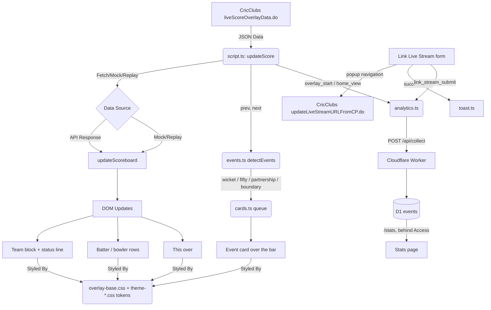

# System Architecture - Cricket Scorecard Overlay

The Cricket Scorecard Overlay is a lightweight, client-side web application designed to display real-time cricket scores during live broadcasts. It leverages the CricClubs API to fetch data, provides a customizable UI through a modular CSS theming system, and includes a small utility for linking a YouTube live stream to a CricClubs match. It's built with Vite + TypeScript and tested with Vitest.

## Project Structure

```text
cricket-scorecard-overlay/
├── worker/             # Cloudflare Worker: /api/collect (D1 insert) and /stats (private report)
│   ├── src/index.ts    # Router + request handling
│   ├── src/collect.ts  # Event validation / normalisation (pure, tested)
│   ├── src/stats.ts    # Aggregate queries + server-rendered stats page
│   ├── src/access.ts   # Cloudflare Access JWT verification for /stats
│   ├── migrations/     # D1 schema
│   └── wrangler.toml   # Routes, D1 binding, Access vars
├── src/
│   ├── assets/images/  # Sponsor logos, imported by config.ts so Vite bundles them
│   ├── script.ts       # Entry point: imports fonts/CSS, then calls into app.ts
│   ├── app.ts          # pollLoop(), updateScore() mode switch, Link Live Stream form wiring
│   ├── analytics.ts    # track()/trackOnce(), client detection, opt-out rules
│   ├── events.ts       # detectEvents(prev, next): wicket / milestone / partnership / boundary from poll diffs
│   ├── cards.ts        # Timed cards on two surfaces (in-bar events, panels above the bar); dismissAll()
│   ├── views.ts        # CricClubs view peeks, ViewCache, match phase, panel builders, PII strip
│   ├── urlBuilder.ts   # Home page link builder: theme options, live URL, copy, preview
│   ├── config.ts       # CONFIG constant (refresh rate, default club ID, logo map)
│   ├── types.ts        # CricketAPIData/CricketAPIValues interfaces modeling the CricClubs response
│   ├── dom.ts          # DOM element lookup map
│   ├── api.ts          # fetchScoreData() - fetches and parses the live score JSON
│   ├── ui.ts           # updateScoreboard()/updateBallByBall()/updateTeamLogos() - DOM updates
│   ├── theme.ts        # applyTheme()/updateLogo() - theme class + sponsor logo switching
│   ├── liveStream.ts   # linkLiveStream() - the Link Live Stream popup workflow
│   ├── toast.ts        # showToast() - transient success/error notifications
│   ├── utils.ts        # getQueryParams(), loadImage(), getBallStyleClass()
│   ├── mockData.ts     # Static match states for ?debug=1-5
│   ├── replayData.ts   # Sequence of match states for ?mode=replay
│   ├── *.test.ts       # Vitest unit tests (ui, utils, liveStream)
│   └── css/
│       ├── instructions.css   # Home screen (setup instructions + Link Live Stream form) styling
│       ├── overlay-base.css   # The overlay layout, shared by every theme
│       └── theme-*.css        # One colour palette per theme (see Theming System below)
├── index.html          # Application entry point & DOM structure
├── architecture.md     # This document
└── README.md           # Quick start and configuration guide
```

## Core Components

### 1. Data Polling Engine
Located in `src/app.ts` (started from `src/script.ts`), `updateScore()` runs once on load and then is re-scheduled with `setTimeout` *after* each run completes (`pollLoop()`), so a slow response can never overlap the next poll. On a failed fetch it keeps the last good frame on screen once at least one has rendered; before that it shows "Error" so a wrong `matchId` is visible during setup.
- **Refresh Rate**: `CONFIG.REFRESH_RATE`, default 5000ms.
- **Fetch Logic**: `fetchScoreData()` (`src/api.ts`) calls the CricClubs `liveScoreOverlayData.do` endpoint and parses the JSON response. This endpoint is public/CORS-open, so it works directly from any origin without credentials.
- **Mode branching**: `updateScore()` decides between showing the home screen (no `matchId`/`debug`/`mode=replay`), mock data (`?debug=1-5`, from `mockData.ts`), replay data (`?mode=replay`, cycling through `replayData.ts`), or a live fetch.

### 2. State Management & DOM Updates
- **DOM Mapping**: The `DOM` constant in `src/dom.ts` maps HTML IDs to typed element references for efficient, repeated updates.
- **Normalization**: `updateScoreboard()` (`src/ui.ts`) processes raw API data and updates text content, visibility, and styles, only touching the DOM when a value actually changes (via `setText`/`setDisplay` helpers) to avoid layout thrash. `statusText()` computes the context around the score: `CRR x.xx` at the end of the score row in the first innings; in a chase `Target n` on the score row and `Need n off o ov · RRR x.xx` on a third row (from the totals, not CricClubs' pre-built HTML message).
- **Event cards**: `app.ts` keeps the previous frame and passes `(prev, next)` to `detectEvents()` (`src/events.ts`), a pure diff that yields wicket (with fall of wicket), fifty/hundred, partnership and boundary events (`parseDismissal()` reduces CricClubs' HTML dismissal string to text). `enqueueCards()` (`src/cards.ts`) plays them one at a time over the batter/bowler slots with per-type hold times; `?quiet` disables them and `?debug=…&card=<type>` holds a sample.
- **Two rules, enforced in code**: every card and panel has a hold time (`HOLD_MS`), and `scoreChanged(prev, next)` (a new ball, runs, a wicket, more overs or an innings change) calls `dismissAll()` before that frame's own cards are queued.
- **Views and panels** (`src/views.ts`): CricClubs' data views drop the live fields, so the overlay stays on the scorebar view during play and only *peeks* (one poll) when nothing can be missed: the two squads before the match, the match summary at the innings break and at the end. `desiredView()` decides, `switchView()` (`api.ts`) asks, `isFullFrame()` keeps peek frames off the bar, `mergeCache()` accumulates cards, squads, extras and fall of wickets (filed by the view's team), and `stripPii()` deletes player emails the moment a frame arrives. `matchPhase()` (pre / play / break / ended) drives `phasePanels()`: intro + squads, innings summary, match summary, rotated on the panel surface while it is idle.
- **Ball-by-Ball Tracking**: `updateBallByBall()` manages the history of the current over, injecting a styled indicator per delivery.
- **Team Logos**: `updateTeamLogos()` caches loaded logo images and only re-fetches when the URL changes.

### 3. Theming System
- **One layout, many palettes.** `src/css/overlay-base.css` holds the entire overlay layout, an ICC-style lower third: batting logo, then the brand-coloured team block (name, score, overs, status line), two batter rows, bowler row plus this-over balls, bowling logo. Event cards slide in over the batter/bowler slots; the result card sits above the bar. It is written in px on purpose, because the overlay renders on a fixed 1920×1080 broadcast canvas rather than in a browser someone zooms, and it honours `prefers-reduced-motion`.
- **Themes are tokens.** Each `src/css/theme-<name>.css` sets ~22 colour custom properties on `.theme-<name>` (surfaces, lines, text, ball outcomes; the list is documented at the top of `overlay-base.css`). No theme file contains layout. `applyTheme()` (`src/theme.ts`) toggles the `theme-<name>` class on `<body>` and falls back to `modern-light` for unknown names (`modern` is an alias for it).
- **Available themes** (17): `classic` (cream/navy), `modern-light` (default), `modern-dark`, `neon`; the 10 IPL franchises `kkr`, `rcb`, `mi`, `csk`, `dc`, `rr`, `srh`, `pbks`, `gt`, `lsg`; and `topguns-light`, `topguns-dark` (old `tel`/`ted`/`tul`/`tud` names are aliases).
- **Adding a theme**: copy any `theme-*.css`, change the token values, `import` it in `theme.ts`, add the name to `AVAILABLE_THEMES`, add a `theme-tag tag-<name>` link to the theme grid in `index.html` plus its `.tag-<name>` colours in `instructions.css`, and update the lists in README.md.
- **Outcome Styling**: `getBallStyleClass()` (`src/utils.ts`) maps cricket outcomes (Wicket, Wide, 4, 6, etc.) to CSS classes (`wicket`, `wide`, `run-4`, `dot`, …) that the base colours via the `--ball-*` tokens. The striker (always batsman 1 in the feed) is marked with an accent dot via the static `on-strike` class in `index.html`, not with text.

### 4. Home Page & Link Live Stream
When no `matchId`/`debug`/`mode=replay` is present, `updateScore()` shows `#instructions` instead of the overlay. It is a small landing page (`index.html` + `src/css/instructions.css`) with proper landmarks, light/dark palettes from `prefers-color-scheme`, `:focus-visible` rings, 44px targets, fluid type and reduced-motion support:
- **Build your overlay link** (`src/urlBuilder.ts`): match ID, club ID (prefilled) and a theme `<select>` render the URL live into an `<output>`, omitting defaults to keep it short; a Copy button uses the Clipboard API and confirms via toast; a preview link opens `?debug=1&theme=<x>`.
- **Themes**: every theme is a link to its sample-data preview.
- **Link Live Stream** form (Club ID, Match ID, YouTube URL), wired up once at startup by `setupLinkStreamForm()` in `src/app.ts`. The submit button is never disabled; it gets `aria-busy` and a "Linking..." label while in flight and repeat submits are ignored.
- **All URL parameters**: a collapsible reference table.

`linkLiveStream()` (`src/liveStream.ts`) attaches a YouTube URL to a CricClubs match via `updateLiveStreamURLFromCP.do`. That endpoint blocks cross-origin subresource requests outright — `fetch` (including `mode: 'no-cors'`) and ``/`<iframe>` embeds all get rejected by a `Cross-Origin-Resource-Policy` check plus WAF heuristics that flag embedded/automated-looking requests. A genuine top-level navigation isn't a subresource load, so it isn't subject to either check. The workaround: open the URL in a small popup synchronously from the click handler (required for the browser to allow it), then close the popup shortly after. This only confirms the request was *sent*; CricClubs' own feed can take up to a minute to reflect the change, so there's no fast, reliable way to verify it client-side, and the toast/copy is worded accordingly ("submitted", not "linked"). It throws `LinkLiveStreamError` with a `code` (`invalid_url` | `popup_blocked`) so the outcome can be reported.

### 5. Usage Analytics
- **Client** (`src/analytics.ts`): `track()` POSTs a small JSON event to `CONFIG.ANALYTICS_ENDPOINT` (`/api/collect`, same origin) with `keepalive`, swallowing every error. `trackOnce()` guards the events fired from the 5-second poll loop so each is sent once per page load. `isTrackingEnabled()` returns false on localhost, in `?debug=`/`?mode=replay`, with `?nostats`, or when Do Not Track is on. `detectClient()` identifies OBS via the injected `window.obsstudio` object or the `OBS/<version>` user-agent token, and vMix / Streamlabs / Prism via user agent.
- **Events**: `overlay_start` (club, match, theme, logo), `home_view`, `link_stream_submit` (club, match, YouTube video ID, outcome from `LinkLiveStreamError.code`). There is deliberately no heartbeat; session length is not tracked.
- **Worker** (`worker/`): Cloudflare proxies `score.abhinav.dev` in front of Netlify, and Worker routes claim only `/api/collect` and `/stats*`. `normalizeEvent()` allow-lists event names, clients and outcomes, requires numeric IDs and caps string lengths before a single `INSERT` into the D1 `events` table. Cloudflare's request metadata supplies country/city/colo; a salted `sha256(ip|ua|day)` gives a per-day visitor count without identifying anyone.
- **Stats page**: `/stats?days=30` runs the aggregate queries in `stats.ts` as one D1 batch and renders HTML. It is protected by Cloudflare Access (JWT verified in `access.ts` against the team JWKS) or, until Access is configured, by a `STATS_KEY` secret passed as `?key=`.

## Data Flow



## Testing & Debugging Modes

- **Unit Tests**: Vitest + jsdom for the site (`app.ts` mode switch, error handling, poll loop and form; `ui.ts` scoreboard, ball-by-ball and logo caching; `utils.ts`; `theme.ts`; `liveStream.ts`; `analytics.ts`; `api.ts`; `toast.ts`) and Vitest + node for the Worker (`worker/vitest.config.ts`; request handling, stats rendering/escaping, Access JWT verification with a generated RSA key, event normalisation). Run via `npm run test` (watch), `npm run test:run` (single run, used in `npm run build`) or `npm run test:coverage` in either package. Line coverage is ~99% for both; `dom.ts` is excluded in spirit because every test mocks it.
- **Debug Mode**: `?debug=1-5` renders static states from `mockData.ts` (1st/2nd innings, match ended, toss, no team logos).
- **Replay Mode**: `?mode=replay` cycles through the states in `replayData.ts` to demonstrate transitions and animations.
- **Theme Previews**: `?theme=<name>` switches between any of the 17 themes.

## External Dependencies
- **`@fontsource/montserrat`**: Self-hosted Montserrat font, bundled at build time (no external font requests at runtime).
- **CricClubs**: `liveScoreOverlayData.do` (public, CORS-open, read) for score polling; `matchOverlayConfig.do?viewId=` (write, CORS-allowed, unauthenticated) switches the server-side view and with it the extra data in the payload; `updateLiveStreamURLFromCP.do` (write, cross-origin-restricted) for the Link Live Stream feature. Full reference: [docs/cricclubs-api.md](docs/cricclubs-api.md).
- **Netlify**: builds `main` and hosts the static site as `score.abhinav.dev`.
- **Cloudflare**: DNS/proxy for the domain; Workers + D1 for the analytics collector and stats page; Access to gate `/stats`.
