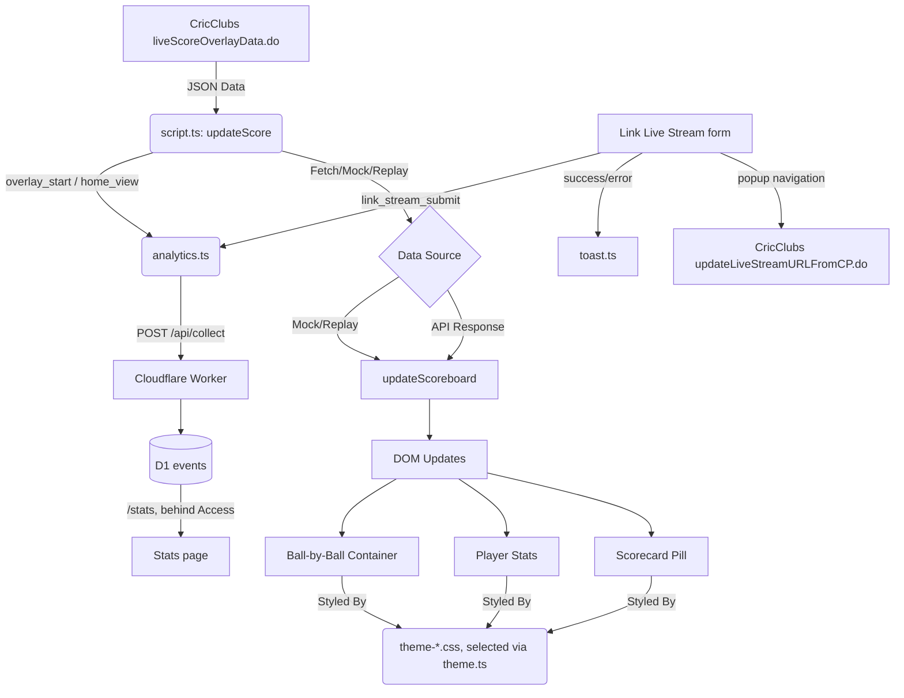

# System Architecture - Cricket Scorecard Overlay

The Cricket Scorecard Overlay is a lightweight, client-side web application designed to display real-time cricket scores during live broadcasts. It leverages the CricClubs API to fetch data, provides a customizable UI through a modular CSS theming system, and includes a small utility for linking a YouTube live stream to a CricClubs match. It's built with Vite + TypeScript and tested with Vitest.

## Project Structure

```text
cricket-scorecard-overlay/
├── worker/             # Cloudflare Worker: /api/collect (D1 insert) and /stats (private report)
│   ├── src/index.ts    # Router + request handling
│   ├── src/collect.ts  # Event validation / normalisation (pure, tested)
│   ├── src/stats.ts    # Aggregate queries + server-rendered stats page
│   ├── src/access.ts   # Cloudflare Access JWT verification for /stats
│   ├── migrations/     # D1 schema
│   └── wrangler.toml   # Routes, D1 binding, Access vars
├── src/
│   ├── assets/images/  # Sponsor logos, imported by config.ts so Vite bundles them
│   ├── script.ts       # Entry point: polling loop, mode/debug/replay branching, form wiring
│   ├── analytics.ts    # track()/trackOnce(), client detection, opt-out rules
│   ├── config.ts       # CONFIG constant (refresh rate, default club ID, logo map)
│   ├── types.ts        # CricketAPIData/CricketAPIValues interfaces modeling the CricClubs response
│   ├── dom.ts          # DOM element lookup map
│   ├── api.ts          # fetchScoreData() - fetches and parses the live score JSON
│   ├── ui.ts           # updateScoreboard()/updateBallByBall()/updateTeamLogos() - DOM updates
│   ├── theme.ts        # applyTheme()/updateLogo() - theme class + sponsor logo switching
│   ├── liveStream.ts   # linkLiveStream() - the Link Live Stream popup workflow
│   ├── toast.ts        # showToast() - transient success/error notifications
│   ├── utils.ts        # getQueryParams(), loadImage(), getBallStyleClass()
│   ├── mockData.ts     # Static match states for ?debug=1-5
│   ├── replayData.ts   # Sequence of match states for ?mode=replay
│   ├── *.test.ts       # Vitest unit tests (ui, utils, liveStream)
│   └── css/
│       ├── instructions.css   # Home screen (setup instructions + Link Live Stream form) styling
│       └── theme-*.css        # One file per theme (see Theming System below)
├── index.html          # Application entry point & DOM structure
├── architecture.md     # This document
└── README.md           # Quick start and configuration guide
```

## Core Components

### 1. Data Polling Engine
Located in `src/script.ts`, `updateScore()` runs once on load and then is re-scheduled with `setTimeout` *after* each run completes (`pollLoop()`), so a slow response can never overlap the next poll. On a failed fetch it keeps the last good frame on screen once at least one has rendered; before that it shows "Error" so a wrong `matchId` is visible during setup.
- **Refresh Rate**: `CONFIG.REFRESH_RATE`, default 5000ms.
- **Fetch Logic**: `fetchScoreData()` (`src/api.ts`) calls the CricClubs `liveScoreOverlayData.do` endpoint and parses the JSON response. This endpoint is public/CORS-open, so it works directly from any origin without credentials.
- **Mode branching**: `updateScore()` decides between showing the home screen (no `matchId`/`debug`/`mode=replay`), mock data (`?debug=1-5`, from `mockData.ts`), replay data (`?mode=replay`, cycling through `replayData.ts`), or a live fetch.

### 2. State Management & DOM Updates
- **DOM Mapping**: The `DOM` constant in `src/dom.ts` maps HTML IDs to typed element references for efficient, repeated updates.
- **Normalization**: `updateScoreboard()` (`src/ui.ts`) processes raw API data and updates text content, visibility, and styles, only touching the DOM when a value actually changes (via `setText`/`setDisplay`/`setVisible` helpers) to avoid layout thrash.
- **Ball-by-Ball Tracking**: `updateBallByBall()` manages the history of the current over, injecting a styled indicator per delivery.
- **Team Logos**: `updateTeamLogos()` caches loaded logo images and only re-fetches when the URL changes.

### 3. Theming System
- **Selection**: `applyTheme()` (`src/theme.ts`) toggles a `theme-<name>` class on `<body>`. Its `THEMES` map also tags each theme as `standalone` or `broadcast`; broadcast themes additionally get a `skin-broadcast` class.
- **Standalone themes** (`classic`, `modern`, `neon`): each `theme-*.css` is a complete, self-contained stylesheet with its own layout rules.
- **Broadcast themes** (the 10 IPL franchises plus `tel`, `ted`, `tul`, `tud`): all layout, typography, geometry and animation live once in `src/css/broadcast-base.css`, scoped under `.skin-broadcast`. Each `theme-*.css` is only a block of colour tokens on `.theme-<name>` (surfaces, lines, glows, text, ball outcomes) plus, rarely, a one-off override (RCB drops the pill's accent borders and adds a text shadow; CSK uses white text on no-balls).
- **Adding a broadcast theme**: copy any broadcast `theme-*.css`, change the token values, import it in `theme.ts`, add it to `THEMES` as `'broadcast'`, then add its tag to the theme grid in `index.html` / `instructions.css` and the lists in README.md.
- **Outcome Styling**: `getBallStyleClass()` (`src/utils.ts`) maps cricket outcomes (Wicket, Wide, 4, 6, etc.) to CSS classes (`wicket`, `wide`, `run-4`, `dot`, …) that the stylesheets colour via the `--ball-*` tokens.

### 4. Home Screen & Link Live Stream
When no `matchId`/`debug`/`mode=replay` is present, `updateScore()` shows `#instructions` instead of the overlay. That screen has two cards:
- Setup instructions (required/optional params, example URL, theme list).
- The **Link Live Stream** form (Club ID, Match ID, YouTube URL), wired up once at startup by `setupLinkStreamForm()` in `src/script.ts`.

`linkLiveStream()` (`src/liveStream.ts`) attaches a YouTube URL to a CricClubs match via `updateLiveStreamURLFromCP.do`. That endpoint blocks cross-origin subresource requests outright — `fetch` (including `mode: 'no-cors'`) and ``/`<iframe>` embeds all get rejected by a `Cross-Origin-Resource-Policy` check plus WAF heuristics that flag embedded/automated-looking requests. A genuine top-level navigation isn't a subresource load, so it isn't subject to either check. The workaround: open the URL in a small popup synchronously from the click handler (required for the browser to allow it), then close the popup shortly after. This only confirms the request was *sent*; CricClubs' own feed can take up to a minute to reflect the change, so there's no fast, reliable way to verify it client-side, and the toast/copy is worded accordingly ("submitted", not "linked").

### 5. Usage Analytics
- **Client** (`src/analytics.ts`): `track()` POSTs a small JSON event to `CONFIG.ANALYTICS_ENDPOINT` (`/api/collect`, same origin) with `keepalive`, swallowing every error. `trackOnce()` guards the events fired from the 5-second poll loop so each is sent once per page load. `isTrackingEnabled()` returns false on localhost, in `?debug=`/`?mode=replay`, with `?nostats`, or when Do Not Track is on. `detectClient()` identifies OBS via the injected `window.obsstudio` object or the `OBS/<version>` user-agent token, and vMix / Streamlabs / Prism via user agent.
- **Events**: `overlay_start` (club, match, theme, logo), `home_view`, `link_stream_submit` (club, match, YouTube video ID, outcome from `LinkLiveStreamError.code`). There is deliberately no heartbeat; session length is not tracked.
- **Worker** (`worker/`): Cloudflare proxies `score.abhinav.dev` in front of Netlify, and Worker routes claim only `/api/collect` and `/stats*`. `normalizeEvent()` allow-lists event names, clients and outcomes, requires numeric IDs and caps string lengths before a single `INSERT` into the D1 `events` table. Cloudflare's request metadata supplies country/city/colo; a salted `sha256(ip|ua|day)` gives a per-day visitor count without identifying anyone.
- **Stats page**: `/stats?days=30` runs the aggregate queries in `stats.ts` as one D1 batch and renders HTML. It is protected by Cloudflare Access (JWT verified in `access.ts` against the team JWKS) or, until Access is configured, by a `STATS_KEY` secret passed as `?key=`.

## Data Flow



## Testing & Debugging Modes

- **Unit Tests**: Vitest + jsdom, covering `ui.ts` (scoreboard rendering, logo caching, instructions visibility), `utils.ts` (query param parsing, ball styling), `theme.ts` (theme/skin classes, sponsor logo), and `liveStream.ts` (popup navigation, error paths). Run via `npm run test` (watch) or `npm run test:run` (single run, used in `npm run build`).
- **Debug Mode**: `?debug=1-5` renders static states from `mockData.ts` (1st/2nd innings, match ended, toss, no team logos).
- **Replay Mode**: `?mode=replay` cycles through the states in `replayData.ts` to demonstrate transitions and animations.
- **Theme Previews**: `?theme=<name>` switches between any of the 17 themes.

## External Dependencies
- **`@fontsource/montserrat`**: Self-hosted Montserrat font, bundled at build time (no external font requests at runtime).
- **CricClubs**: `liveScoreOverlayData.do` (public, CORS-open, read) for score polling; `updateLiveStreamURLFromCP.do` (write, cross-origin-restricted) for the Link Live Stream feature.
- **Netlify**: builds `main` and hosts the static site as `score.abhinav.dev`.
- **Cloudflare**: DNS/proxy for the domain; Workers + D1 for the analytics collector and stats page; Access to gate `/stats`.
