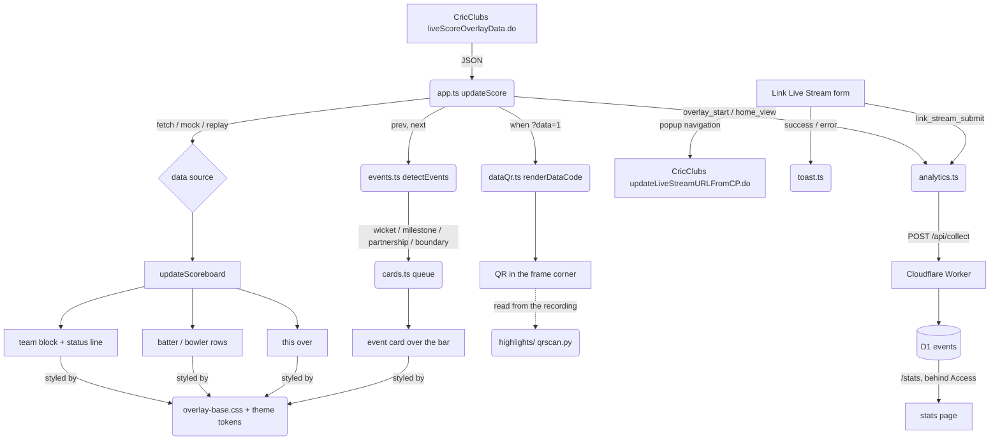

# overlay.md — the overlay application

**Load before changing anything under `src/`.**

A client-side cricket scorecard overlay for OBS/vMix browser sources. Vite + TypeScript, no
framework, no backend. It polls the public CricClubs `liveScoreOverlayData.do` endpoint every
five seconds and paints a fixed-position DOM. Everything is driven by URL query params; the
user-facing table is in [README.md](../README.md).

---

## 1. Entry and the poll loop

`index.html` loads `src/script.ts` as a module. `script.ts` imports only the Montserrat font
CSS and `css/instructions.css` — theme CSS is imported by `theme.ts` — then calls into
`src/app.ts`, which holds all orchestration and is where the tests point.

`app.ts` does two things on startup: wires the Link Live Stream form once
(`setupLinkStreamForm`), and runs `pollLoop()`.

🛑 **`pollLoop()` is a timeout chain, not `setInterval`.** It awaits `updateScore()` and only
then re-arms a `setTimeout(CONFIG.REFRESH_RATE)`, so a slow CricClubs response can never
overlap the next poll. Do not "simplify" this to an interval.

A failed fetch keeps the last rendered frame once one has painted, and shows "Error" only
before the first successful render. That asymmetry is deliberate: a single dropped poll
mid-broadcast must not flash an error at viewers, but a wrong `matchId` has to be visible to
whoever is setting the source up.

## 2. The mode switch

`updateScore()` branches in this order:

1. no `matchId`, no `debug`, not `mode=replay` → show `#instructions`, hide `.overlay`
2. `debug=1..5` → static state from `mockData.ts`
3. `mode=replay` → a simulated CricClubs in the page (below)
4. otherwise → fetch live

Mock fixtures are cast `as unknown as CricketAPIData` because they do not fill every field of the
(large) type in `types.ts`.

### 2a. Replay is a simulated CricClubs, not a fixture loop

`?mode=replay` plays a whole match, toss to result, generated by `sim/match.ts` from the recorded
cards of match 2079. It is not a separate code path: a **`Feed`** supplies frames and receives view
switches, and replay simply swaps CricClubs for the simulated match. So the line-up, the event
cards, the innings-break peeks, the result card, super overs and `?data=1` all run exactly the code
a live match runs — which is what makes it a rehearsal. It needs no match ID and makes no network
call to CricClubs, and like every non-live mode it sends no analytics.

| Param | Effect |
|---|---|
| `speed` | 5 by default. ×1 is 2 h 23 min, ×2 72 min, ×5 29 min, ×10 14 min, ×30 5 min |
| `start` | begin at a phase: `pre`, `inn1`, `break`, `inn2`, `ended` (`so1`… with `superover`) |
| `superover` | the tie-and-super-over scenario |
| `seed` | a different generated match |

⚠ **The speed is capped at ×30, and the replay reads every second** (`REPLAY_REFRESH_MS`). A
simulated ball is 30 s apart, so up to ×30 every ball still gets a read of its own, the way every
live ball gets a 5 s poll; faster, two balls land between reads and one of them never raises its
card. At the default ×5 a ball comes every 6 s, which cuts a wicket card's 8 s hold short — the
dismiss-on-score rule doing its job. Use `speed=2` to see cards at broadcast length.

✅ **It costs a live overlay nothing.** The simulator is loaded with a dynamic `import()`, so it is
a separate 12 kB chunk fetched only in replay mode. ⚠ It must not import fixtures the live bundle
does not already carry: pulling in the 8 kB summary view (`mock_view_8`) for three team fields
grew the main bundle by 5 kB, because shared fixture modules cannot be tree-shaken per importer.
Measured against production: the main bundle ended up 1.6 kB *smaller*, with the old
`replayData.ts` gone.

## 3. Rendering discipline

`src/ui.ts` owns the DOM. `updateScoreboard()` picks team 1 vs team 2 fields from
`values.isSecondInningsStarted === "true"`, then writes through the `setText` helper
that only touch the DOM when a value actually changed, to avoid layout thrash.

⚠ **API booleans are strings.** `isSecondInningsStarted` is `"true"`, and `isMatchEnded` is
`"1"`. Comparing them as booleans silently fails.

`statusText()` supplies the CRR / Target tail on the score row and the Need / RRR third row in
a chase, computed from the totals rather than from CricClubs' pre-built HTML message. There is
no separate second-innings strip any more.

`updateTeamLogos()` caches by URL so polling does not refetch images. Logo URLs from the API
may be relative; it prefixes `https://cricclubs.com`.

## 4. 🛑 `dom.ts` runs `getElementById` at import time

`DOM` is a plain object of element references resolved when the module first loads. Every
consequence below has bitten:

- Anything importing `dom.ts` (`ui.ts`, `theme.ts`, `script.ts`) needs the real `index.html`
  structure present at import.
- **In tests, never import `dom.ts` directly.** `ui.test.ts` does `vi.mock('./dom', ...)` with
  a Proxy mapping property names to element IDs, looked up lazily *after* `beforeEach` has
  built the elements. Follow that pattern for any new test touching `ui.ts`. `app.test.ts`
  instead mocks every collaborator (`./api`, `./ui`, `./theme`, `./analytics`, `./toast`,
  `./liveStream`) and asserts on calls.
- Modules with state expose `reset*ForTests()` hooks (`app.ts`, `ui.ts`, `analytics.ts`,
  `dataQr.ts`) — call them in `beforeEach` rather than reaching into module internals.
- **Adding an element means adding it in three places**: `index.html`, `dom.ts`, and the
  `idMap` in `ui.test.ts`. Miss the third and the test suite fails confusingly.
- The Worker has its own `worker/vitest.config.ts` (node environment). Without it Vitest walks
  up and uses the site's jsdom config. The root config restricts `include` to `src/**` so the
  two suites never mix.

## 5. Theming: one layout, many token sets

`applyTheme()` puts a `theme-<name>` class on `<body>`. Unknown names fall back to
`modern-light`, and `modern` is kept as an alias in `THEME_ALIASES`.

All 17 themes share one layout, `src/css/overlay-base.css` — an ICC-style lower third: batting
logo, brand-coloured team block, two batter rows, bowler row with this-over balls, bowling
logo. Each `theme-*.css` is **only** a block of ~22 colour tokens on `.theme-<name>`; the token
list is documented at the top of the base file.

🛑 **Never put layout in a theme file. Change the base.**

The base uses px deliberately — the overlay renders on a fixed 1920×1080 broadcast canvas, not
in a browser someone zooms — and it respects `prefers-reduced-motion`.

The striker is marked with the static `on-strike` class on the **first batter row** in
`index.html`, not with text. The API's ordering is what marks it, which is why `batsman1` is
always the striker for anything reading the feed — see [data-code.md](./data-code.md) §2.

**Adding a theme**: copy any `theme-*.css` and change the tokens, `import` it in `theme.ts`,
add the name to `AVAILABLE_THEMES`, add a `theme-tag tag-<name>` link in the `index.html` theme
grid plus its `.tag-<name>` colours in `instructions.css`, and update the theme lists in
`README.md`.

The 17: `classic`, `modern-light` (default), `modern-dark`, `neon`; the ten IPL franchises
`kkr`, `rcb`, `mi`, `csk`, `dc`, `rr`, `srh`, `pbks`, `gt`, `lsg`; and `topguns-light`,
`topguns-dark` (old `tel`/`ted`/`tul`/`tud` names remain aliases).

## 6. Event cards

`app.ts` keeps the previous frame and calls `detectEvents(prev, next)` (`src/events.ts`, pure
and tested) after every render, then `enqueueCards()` (`src/cards.ts`) plays them one at a time
over the batter/bowler slots.

| Card | Trigger | Holds |
|---|---|---|
| Wicket | the batting side's wicket count rises | 8 s |
| Fifty / Hundred | a batter crosses 50 or 100 | 8 s |
| Four / Six | the newest ball is a boundary off the bat | 2 s |
| 50 / 100 partnership | the current stand crosses 50 or 100 | 6 s |
| Line-up (panel) | before the first ball, once | 60 s, or until both openers are in |
| Innings summary (panel) | the first innings is complete, once | 2 min, or until the chase begins |
| Match summary (panel) | the match ends, once | for good (drawn again when the award is named) |

The last three render on a **second surface above the bar** and are built from CricClubs' data
views rather than from poll diffs — see §14.

🛑 **A waiting panel goes on air once per load, never on a loop.** The line-up is about a third
of a 1080p frame and sits over the middle of the picture, where the players are. It used to be
re-queued whenever the panel surface went idle, so on match 4651 it cycled 16 s on, 4 s off for
the whole wait before the first ball. `panelsShown` in `app.ts` now allows one showing per phase,
and `openersIn()` takes the line-up or innings summary off early with `dismissPanel()` once both
batter names are filled. At the break the names must also differ from the ones the break began
with, since the first innings' last pair may still be in the fields.

⚠ **Before the first ball CricClubs sends the batter names empty until the scorer picks the
openers** (seen live on 4651). The line-up shows even before the toss, since the squads are
already in; its toss line then reads "Toss pending".

🛑 **The break begins when the first innings is complete, not when the second starts.** CricClubs
keeps `isSecondInningsStarted` false, with the last pair still in the batter fields, until the
scorer starts the second innings by picking the openers, about a minute before its first ball.
`matchPhase()` waiting for that flag put the summary on air for 58 s after a 10-minute break on
4651, and for 5 s after 6 minutes on 4655. It now calls a complete first innings (all overs, or
ten down) the break. The summary comes off when the scorer starts the chase: the chase flag
flipping counts as a score change, and `openersIn()` sees new names too. ⚠ A rain-shortened
innings is not recognised as complete; its break starts at the flag, as before.

⚠ **The player of the match is named some time after the result**, so the result's first
performer slot reads "Awaiting" until CricClubs sends it, and the panel is drawn again then.

🛑 **Scorers undo and redo balls, and each redo looks like a new event.** Match 4655 showed three
wicket cards for one wicket, one of them for the wrong batter. `freshEvents()` in `app.ts` keys each
card by what it is about — the wicket's number and who was out, a batter and their mark, or a
delivery's place in the innings — and never shows the same key twice. A corrected wicket (a
different batter out) is a new key, so it still gets its card.

Hold times live in `HOLD_MS`. ⚠ **The exit transition length is duplicated** between `cards.ts`
(`TRANSITION_MS`) and the `.event-card` CSS — keep them equal.

Adding a card type means: a new `OverlayEvent` variant, a detection rule, `cardCopy()` text, a
`HOLD_MS` entry, a `SAMPLE_EVENTS` entry (for `?debug=1&card=<type>`), and usually a
`[data-type]` CSS rule.

**Cards are the only thing that may cover the bar; the team block must always stay visible.**

Two rules are enforced in `renderFrame()` and must survive any refactor: every card and panel
is timed via `HOLD_MS`, and `scoreChanged()` → `dismissAll()` runs before a frame's cards are
queued. The only other early exit is `dismissPanel()` for a waiting panel once the openers are in.

### 6a. 🛑 The accent palette is a contract, not decoration

Each card type has its own fixed colour, declared once in `overlay-base.css` and **never**
overridden by a theme:

| Token | Colour | | Token | Colour |
|---|---|---|---|---|
| `--ob-wicket` | `#d7263d` | | `--ob-milestone` | `#ff7300` |
| `--ob-four` | `#1b9e4b` | | `--ob-partnership` | `#00bcd4` |
| `--ob-six` | `#6d3df5` | | | |

`highlights/` identifies what happened in a recording from that 5 px stripe alone, so changing
a value or letting a theme re-theme one **silently breaks highlight detection on every future
match**. The five are chosen for maximum channel distance from each other, at least 150 apart
on a 0–765 summed-RGB scale. If you add a card type, pick a colour at least that far from all
of them and record it in [highlights.md](./highlights.md) §5.

Milestone and partnership only got their own colours in `3f0a282`; before that they fell back
to the theme's brand accent, which collides with the team block in the topguns themes.

### 6b. ⚠ A boundary off an illegal delivery arrives fused with the penalty

A six off a no-ball reaches the overlay as **`7nb`**, not `6`. `detectEvents()` exact-matched
`'4'` and `'6'`, so no card fired and the ball disc was coloured amber as a plain no-ball — the
shot was then invisible to `highlights/` too. Fixed in `c455921`.

`runsOffBat()` in `src/utils.ts` now parses runs off the bat and both call sites use it.
Scorers are inconsistent about including the penalty, so **`6nb` and `7nb` are both a six**.
Wides, byes and leg-byes score nothing off the bat however many runs they carry, so a boundary
from one is not a batting boundary. The disc prints the raw outcome, so recolouring keeps
"7nb" legible.

## 7. The home page

`#instructions` is plain HTML in `index.html` styled by `css/instructions.css` (light/dark
tokens prefixed `--h-`). Its URL builder lives in `urlBuilder.ts`.

⚠ **Keep the element ids stable** — `app.test.ts` and `urlBuilder.test.ts` mount minimal copies
of that markup.

## 8. 🛑 Link Live Stream must stay a popup, not a fetch

`src/liveStream.ts` attaches a YouTube URL to a CricClubs match via
`updateLiveStreamURLFromCP.do`. CricClubs blocks that endpoint as a cross-origin **subresource**
— a `Cross-Origin-Resource-Policy` check plus WAF heuristics — so `fetch` (including
`mode: 'no-cors'`), `` and `<iframe>` all fail.

A genuine top-level navigation is not a subresource load, so it escapes both checks. The
working approach is `window.open` in a small popup, **synchronously inside the submit handler**
(required for the browser to allow it), closed after about two seconds.

**Do not "simplify" this back to `fetch`.** Commits `25ceb63` and `f7459e3` document the failed
attempts.

There is also no client-side way to verify the update landed — CricClubs' own feed lags by up
to a minute — so the success copy says "submitted", not "linked". `LinkLiveStreamError` carries
a `code` (`invalid_url` | `popup_blocked`) so the outcome can be reported to analytics.

## 9. Configuration

`CONFIG` (`src/config.ts`) holds the refresh rate, the default club ID (LPCL, `1089463`), the
`?logo=` → sponsor image map (images imported from `src/assets/images/` so Vite bundles them),
and the analytics endpoint.

`vite.config.ts` sets `base: './'` for relative paths in overlays. 🛑 **Don't change it.**

## 10. Commands

```bash
npm run dev            # Vite dev server on http://localhost:5173
npm run test           # vitest watch mode
npm run test:run       # single run — this is what build and CI use
npm run test:coverage  # v8 coverage table (also available in worker/)
npx vitest run src/utils.test.ts            # one test file
npx vitest run -t "should return wicket"    # one test by name
npx tsc                # typecheck only (noEmit; strict + noUnusedLocals + noImplicitReturns)
npm run build          # tsc && test:run && vite build -> dist/ (dist is gitignored)
npm run preview        # serve the production build
```

There is no linter. ⚠ **`npm run build` fails on type errors *and* test failures** — run it
before opening a PR. CI (`.github/workflows/ci.yml`) runs the site build and the Worker
typecheck/tests on every PR.

Branch naming in history is `feature/…`, `fix/…`, `docs/…`; commit subjects use conventional
prefixes (`feat:`, `fix:`, `docs:`, `ci:`, `test:`).

## 11. Project structure

```text
cricket-scorecard-overlay/
├── docs/               # this knowledge bundle (OKF v0.2)
├── worker/             # Cloudflare Worker: /api/collect and /stats
│   ├── src/index.ts    # router
│   ├── src/collect.ts  # event validation / normalisation (pure, tested)
│   ├── src/stats.ts    # aggregate queries + server-rendered stats page
│   ├── src/access.ts   # Cloudflare Access JWT verification
│   ├── migrations/     # D1 schema
│   └── wrangler.toml   # routes, D1 binding, Access vars
├── highlights/         # reads a recording, cuts reels (Python)
├── sim/                # simulated match: generator, fake CricClubs, headless e2e runner
├── src/
│   ├── script.ts       # entry: fonts/CSS, then app.ts
│   ├── app.ts          # pollLoop(), updateScore() mode switch, renderFrame()
│   ├── api.ts          # fetchScoreData()
│   ├── ui.ts           # updateScoreboard() / updateBallByBall() / updateTeamLogos()
│   ├── events.ts       # detectEvents(prev, next) — pure poll diff
│   ├── cards.ts        # timed cards on two surfaces (in-bar events, panels above the bar)
│   ├── views.ts        # CricClubs view peeks, ViewCache, match phase, panels, PII strip
│   ├── dataCode.ts     # 🛑 the ?data=1 wire format (see data-code.md)
│   ├── dataQr.ts       # packs the payload and draws the QR
│   ├── theme.ts        # applyTheme() / updateLogo()
│   ├── liveStream.ts   # 🛑 the popup workflow (see §8)
│   ├── analytics.ts    # track() / trackOnce(), client detection, opt-out
│   ├── urlBuilder.ts   # home-page link builder
│   ├── dom.ts          # 🛑 element map, resolved at import time (see §4)
│   ├── config.ts       # CONFIG: refresh rate, default club, logo map
│   ├── types.ts        # the CricClubs response shape
│   ├── utils.ts        # getQueryParams(), runsOffBat(), getBallStyleClass()
│   ├── mockData.ts     # static states for ?debug=1-5
│   ├── tools/          # build-time scripts; typechecked, never bundled
│   └── css/
│       ├── overlay-base.css   # the whole layout, shared by every theme
│       ├── theme-*.css        # one colour-token block each
│       └── instructions.css   # the home page
└── index.html          # DOM structure
```

## 12. Data flow



## 13. Where the simulator lives

`sim/` drives the real overlay in headless Chrome through a whole generated match and grades
the rules — peeks only while idle and never repeated, panels wait for their peeks, every card
timed, every dismissal explained by a score change. **Run it after any change to `views.ts`,
`cards.ts`, `events.ts` or `app.ts`**; unit tests did not catch the three bugs it found on its
first runs.

```sh
npm run sim                                     # serve the fake CricClubs
npm run sim:run                                 # an ordinary match, graded (18 checks)
npm run sim:run -- --super-over                 # a tie decided by a super over (21 checks)
npm run sim:run -- --super-over --seed 1        # one whose super over has wickets in both innings
```

⚠ **zsh does not word-split a variable**, so `npm run sim:run -- $args` with
`args="--super-over --seed 1"` passes one argument that matches neither flag, and quietly runs the
*ordinary* match. Spell the flags out.

**The super-over scenario ties the main match by construction.** A random chase rarely finishes
level, and this simulator's chasing side reliably falls ~20 short (a not-out batter's replayed card
runs out with nobody out to bring the next one in), so no seed search finds one. Instead each
innings draws from its own random stream and both are capped at the lower side's natural total;
separate streams matter, because with one shared stream capping the first innings shifts every
draw after it. The super over itself is one over each, three batters, the fielding side's most
successful bowler, redrawn if it ties again.

⚠ **It models the super-over scorebar on the one capture there is**, match 2079 after the result:
sides swapped, super-over totals, overs as a ball count, and `isSecondInningsStarted` left as the
main match's flag with the super over on `isSuperOverSecondInningsStarted`. That last part is an
assumption — see §14b.

**The over limit is a preference, not a rule.** A bowler is normally held to a fifth of the overs,
but ⚠ **CricClubs lets the scorer override it and give a fifth over**, and leagues do. The overlay
has no limit of its own — it shows whatever CricClubs sends, and the `?data=1` code has 7 bits for a
bowler's balls (127, against 30 for a five-over spell). So the generator schedules within the usual
limit — whoever has the most overs left goes next, which is how a captain avoids the last over
belonging to the previous over's bowler — and when nobody else is under it, gives the least-used
bowler an extra over, as a scorer would. The report states each run's busiest bowler and any
overrides; it does not fail on them.

⚠ The overlay hooks it relies on — `?api=`, `?refresh=`, `?e2e` in `src/e2e.ts` — are
**localhost-only**, so none of this changes production behaviour.

## 14. Views and panels (`src/views.ts`)

CricClubs serves the same match through numbered **views**, and the extra data in each comes at
a price: 🛑 **a data view drops the live score fields.** So the overlay stays on the scorebar
view while the ball is live and only *peeks* at another view when nothing can be missed.

| Phase | Peeked for |
|---|---|
| pre-match | both squads |
| innings break | team 1's batting and bowling cards |
| ended | team 2's cards too |

`desiredView()` decides what is still wanted, `switchView()` (`api.ts`) asks for it via
`matchOverlayConfig.do?viewId=` — write, CORS-allowed, unauthenticated — and the next poll
returns that view. Full endpoint reference in [cricclubs-api.md](./cricclubs-api.md).

🛑 **`isFullFrame()` keeps a peek off the bar.** A peek frame has no live fields, so rendering
it would blank the score, and counting it as a score change would dismiss a card that had only
just appeared. It also must not reach the `?data=1` code: encoding a peek would hand
`highlights/` a CRC-valid frame of nonsense, which is why `setDataCode()` sits below that guard
in `renderFrame()`.

`mergeCache()` accumulates what the peeks return — cards, squads, extras, fall of wickets, filed
by the view's own team — because each peek sees only part of the match. `matchPhase()`
(pre / play / break / ended) then drives `phasePanels()`.

⚠ **Panels wait for their phase's peeks to land** (or to be given up on after `PEEK_ATTEMPTS`)
and only render while the panel surface `isIdle()`, so a panel never appears half-empty and
never interrupts one already showing.

🛑 **A view that has used its tries is skipped, not retried.** `desiredView()` asks for the first
missing piece of the phase, and it used to do that unconditionally — so one view that never
yielded blocked every view after it. A failed team 1 squad meant team 2's was never requested, and
the line-up went on air with *both* XIs empty. It now takes the set of views that have used their
tries and moves past them. The simulator cannot catch this: every peek it serves succeeds first time.

✅ **After a switch the overlay reads again almost at once.** `switchView()` resolves when CricClubs
answers (with a `SWITCH_TIMEOUT_MS` ceiling, never rejecting), and a poll that asked for a switch is
followed by one `PEEK_FOLLOW_MS` (300 ms) later instead of a full refresh. Measured on match 4631,
CricClubs' own overlay sat on the data view for **1.47 s per peek instead of 6.16 s** — about 9 s a
match instead of 37 — and the 300 ms read still collected the squad. It is the same single timeout
chain, so polls never overlap. 🛑 Coming home is not attempt-limited, so `MAX_FAST_POLLS`
consecutive fast reads fall back to the normal cadence; without the cap a feed stuck on a data view
would fast-poll forever. ⚠ The simulator already polls every 250 ms, below the follow-up, so it
cannot show this gain — the unit tests pin it instead.

✅ **A view switch applies within one poll — measured.** On finished match 4631 (2026-09-24), four
switches (1→48, back, 1→2, back) had each taken effect by the *first* read, 0.37–0.41 s after the
request; that figure is the read's own round trip, so the switch itself is at least that fast.
`PEEK_ATTEMPTS` × 5 s is ample, and the simulator's instant switch is realistic. The payload shape
matched the `view` field every time. ⚠ Measured on a **finished** match; a live one could be served
differently, so the first real break is worth watching. Link Live Stream's minute-long lag is a
different endpoint and does not apply here. [cricclubs-api.md](./cricclubs-api.md) §2.

### 14a. 🛑 `stripPii()` runs first, on every frame

Player rows in the CricClubs card views carry **email addresses**. `stripPii()` deletes them the
moment a frame arrives, before anything renders, caches or logs it — so no email can reach the
DOM, the view cache, a screenshot or a committed fixture. The fixtures in `mockData.ts` were
captured live with the emails removed.

🛑 **It walks the whole payload rather than a list of known keys.** The list version was correct
for every view in [cricclubs-api.md](./cricclubs-api.md) §3, but a new CricClubs view with a new
row-bearing key would have leaked emails **silently onto a public broadcast**, and nobody would
notice until someone paused the stream. A walk cannot be outrun by a payload shape we have not
seen. It carries a `WeakSet` so a cyclic payload cannot hang the poll loop.

This is a ground rule, not a nicety: the overlay is composited into a public broadcast and this
repository is public.

### 14b. 🛑 A live super over is not an innings break

The scorebar **swaps to the super-over sides and totals** ([cricclubs-api.md](./cricclubs-api.md)
§3), so the gap between the two super-over innings is indistinguishable from an innings break by
overs and balls alone: the chase has started, the "second" side has no overs, nothing is in hand.

Read as `break`, that puts the **main match's** first innings on air — stale, and labelled
"1st innings" — while a super over is actually being bowled. `matchPhase()` therefore returns
`play` whenever `isSuperOver` is set, checked *after* `isMatchEnded`, so a **finished** super over
is still `ended` and still gets its match summary.

⚠ **Match 2079, the source of every fixture in `mockData.ts`, is a super-over tie** — but it was
captured *after* the match ended, so `isMatchEnded` is `'1'` and the real frame short-circuits to
`ended`. The broken window never appeared in any fixture, which is why nothing caught it. The
test winds that capture back to mid-super-over.

⚠ **`isSuperOver` stays true for the rest of the match once a super over happens**, so it is not
a "right now" flag on its own — it only means "live super over" *below* the `isMatchEnded` check.

🛑 **Which side is batting is decided in one place: `battingSecond()` in `utils.ts`.** Four modules
used to read `isSecondInningsStarted` each on their own — the bar, event detection, the
dismiss-on-score rule and the `?data=1` code. If that flag stays the *main* match's all through a
super over, as the one capture allows, every one of them names the wrong side for the whole first
super-over innings: the bar shows the side not batting, its wickets go undetected, and the data
code carries the wrong total. The simulator found it — 6 of 6 samples showed the wrong team — and
proved the wicket half by failing with the fix reverted (14 cards for 15 wickets).
`battingSecond()` prefers `isSuperOverSecondInningsStarted` while `isSuperOver` is set. That is right
if the flag stays the main match's, and changes nothing if it follows the super over instead,
because then the two agree. **A live super-over capture would settle which it is.**

🛑 **Super-over overs arrive as a ball count** — this part is fact: the capture has `t1Overs` `"6"`
for a completed one-over super over. `teamOvers()` turns it into overs notation for the bar, the
this-over strip, the chase line and the data code, all of which showed "3 ov" or counted 18 balls
before. `matchOvers()` makes the chase count down from one over, not twenty. ⚠ Team overs only:
there is no evidence for a bowler's figure in a super over, and a bare "1" there could be an over
or a ball, so bowler overs are left as sent.

### 14c. The result card

The match-summary panel follows a broadcast result card: the result as the headline over a rule,
one card per side in batting order, then an inverted strip of top performers.

- 🛑 **Each card holds that side's own players** — its two top batters and its own best bowler.
  The earlier version paired a side's batters with the *opposition* bowler who bowled at them,
  an innings view that read as if the bowler belonged to the team named above him.
- **The winner's card carries the brand-accent edge**; the other gets the divider colour.
  `resultWinner()` reads the winner from the result text by full name *or* team code, because
  CricClubs writes both — `"TOPGUNS UNITED won by 5 Wickets"` and, after a tie,
  `"Match tied. TGN won the super over."`. ⚠ The capture must not cross a full stop, or that second
  form yields `"Match tied. TGN"` and no winner. Wording it cannot pin to a side marks **no** winner,
  never a guessed one.
- `resultHeadline()` writes team names exactly as CricClubs stores them ("AVV XI" was once
  re-cased to "Avv Xi"), expands a winner's code to its name and lower-cases
  `"5 Wickets"`. Anything it does not recognise passes through unchanged.
- ⚠ **Team codes are cached from the data views, with the names.** The scorebar carries them too,
  but it swaps sides during a super over (§14b), so pairing its `t1Code` with a data view's
  `t1Name` puts the wrong badge on each card.
- The crest is shown when there is one; otherwise the team code in a square badge.
- **Top performers**: CricClubs' own `manOfTheMatch` first when it is set, then the match's top
  scorer, its best bowling, and the other side's top scorer, with nobody listed twice. ⚠ The award
  is a full name with no player id, so it is matched to the cards by first and last name; an award
  that matches no card is still shown, under the name CricClubs gave.
- ⚠ **A player can appear twice on one card** — once as a batter and again as the best bowler.
  That is an all-rounder, not a duplication bug.
- The strip reuses the inverted surface of the innings summary's Target tile, so it is dark on a
  light theme and light on a dark one. Neither piece needs a theme file to know it exists.
